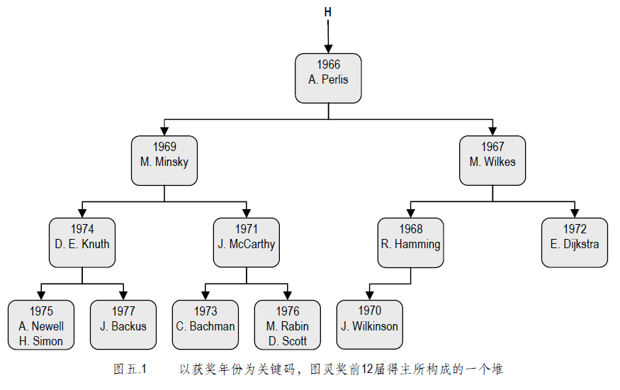
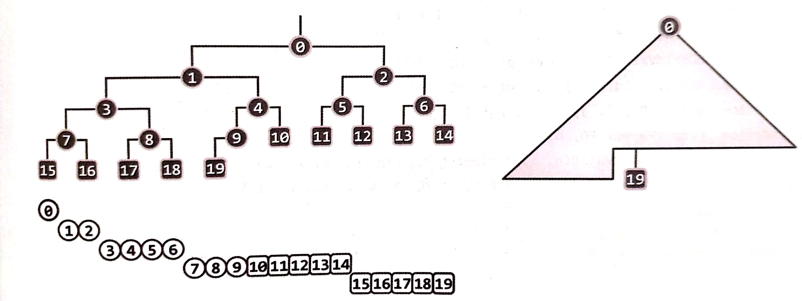

# 数据结构——堆
## 0. 前言
### 优先级队列
在介绍堆（heap）之前，我们先简单介绍一下优先队列。

**优先级队列（priority queue）**指的是能够按照事先约定的**优先级（priority）**，始终高效查找并访问优先级最高数据项的数据结构。

优先级队列支持的操作接口如下：

操作接口 | 功能描述
---|---
``getSize()`` | 获取优先级队列的大小
``insert(ele)`` | 将指定词条插入优先级队列
``getMax()`` | 获取（非空）优先级队列的最大元素（或最小）
``delMax()`` | 删除（非空）优先级队列的最大元素（或最小）

### 优先级队列的实现方式
优先级队列可以通过以下的一些数据结构实现：
1. 向量
2. 链表

**堆**是实现优先级队列最高效的数据结构，其``getMin()``操作只需要*O(1)*的时间复杂度，``insert()``和``delMin()``也仅需要*O(log(n))*的时间复杂度。

下面介绍堆的最基本的形式——完全二叉堆（complete binary heap）。

## 1. 堆的特性
下面是一个堆的示意图：



堆必须满足两个特性：
1. 堆序性：就其关键码而言，除堆顶外的任何条目都不小于（大于）其父亲；
2. 结构性：H 中各元素的联结关系应符合二叉树的结构要求（其根节点称作堆顶）。

由于二叉树的搜索效率很大程度上取决于树的高度，为了提高搜索的效率，我们再加上一条要求：

3. 完全性：堆必须是一棵完全二叉树。

## 2. 堆的向量表示
由于堆是一棵完全二叉树，因此可以通过向量来更为方便地进行表示。这一实现方法的优势在于：
1. 各个结点在物理上连续排列，仅需要*O(n)*的空间；
2. 利用各个结点的编号（秩），可以更便捷判断父子关系。

转换的示意图如下：



容易验证，堆中二叉树内的结点与向量秩存在以下关系：
1. 对于秩为``i``的结点``v``，如果有左孩子，则其左孩子的秩为``i*2 + 1``；
2. 对于秩为``i``的结点``v``，如果有右孩子，则其右孩子的秩为``i*2 + 2``；
3. 对于秩为``i``的结点``v``，其父结点的秩为``floor((i-1)/2)``。

通过上述表示，``getMin()``或``getMax()``接口可以直接返回向量秩为``0``的值，其时间复杂度为*O(1)*。下面对``insert()``和``delMin()``接口进行分析。

## 2. 元素插入``insert()``
元素插入的步骤：
1. 首先在向量末端插入待插入元素；
2. 不断**上滤**直至满足*堆序性*。

### 上滤
上滤过程主要用于不断调整先插入元素与其父节点的顺序，最终使得满足*堆序性*。以小顶堆为例，在堆向量末端插入一个元素后，此时*堆序性*不一定满足，需要对比新插入的元素``e``与其父结点``p0``的关系，如果``e < p0``，则将``e``和``p0``进行对调；之后再对比``e``与新的父结点``p1``的大小关系，如果小于父结点则再次对调，并不断对比直至``e >= pn``，这个时候堆满足*堆序性*。

代码如下：
```c++
Rank percolateUp (Rank i) {
    while(parentIsValid(i)) {  // 如果当前结点有父结点（当前结点非root）
        Rank j = Parent(i);
        if (isOrdered(_elem[i], _elem[j])) {
            // 如果顺序合法（小顶堆父结点小于等于子结点）
            break;
        } else {
            swap(_elem[i], _elem[j]);
            i = j;
        }
    }
    return i;
}
```

## 3. 元素删除``delMin()``
根据堆接口的定义，元素删除只会删除堆顶的元素，具体的删除步骤为：
1. 首先将堆顶的元素备份；
2. 将堆向量末端的元素移动到堆顶；
3. 不断**下滤**直至满足*堆序性*。

### 下滤
下滤思想和上滤思想一致，不过需要注意的是，在下滤过程中，当前（不合法的）父结点可能有两个孩子，需要选择使得替换后能够合法的子结点进行替换（如大顶堆时需要和更大的子结点进行替换）。给出代码如下：
```c++
Rank percolateDown(Rank n, Rank i) {
    Rank j;
    while (i != (j = ProperParent(_elem, n, j))) {
        swap(_elem[i], _elem[j]);
        i = j;
    }
    return i;
}
```

## 4. 堆排序
有了上面堆向量的知识和堆的``delMin()``算法实现，堆排序的流程不言而喻。

## Appendix
给出JavaScript版本的

